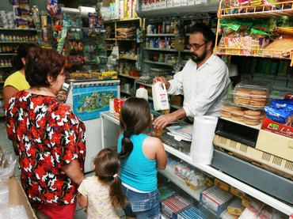
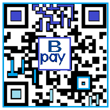
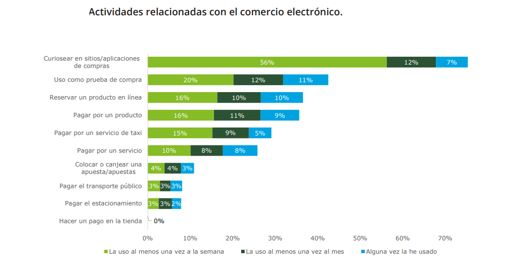
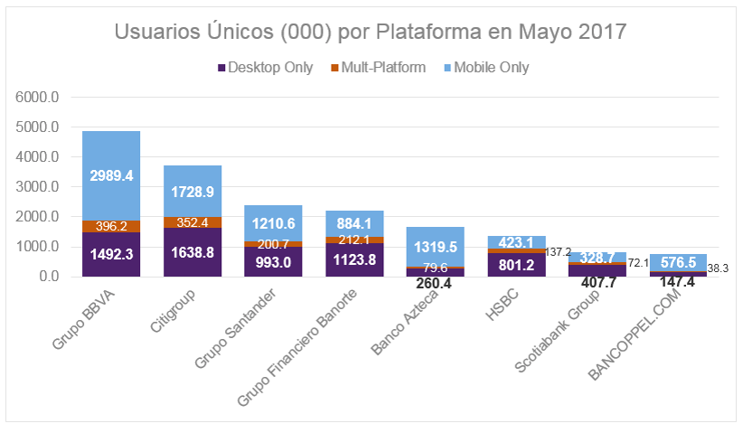

#  Simplificacion del proceso de pago con QR

###  Un poco de historia.

Los códigos QR fueron creados **en 1994 por Denso Wave, subsidiaria de Toyota**, y su nombre viene del inglés **quick response**, o  respuesta rápida, ya que el objetivo de sus creadores era inventar un código que se leyese de manera rápida. Los códigos QR son muy populares en Japón, de hecho, son el código bidimensional más popular en el país nipón.

Inicialmente, fueron usados para registrar repuestos en el área de fabricación de vehículos, pero poco a poco, y más aún con la aparición y la popularización de los Smartphones y tablets, se han ido extendiendo más.

##  ¿Qué es un código QR?

Las siglas QR provienen de **“Quick Response”**, y significan literalmente “respuesta rápida”. La principal diferencia de los códigos QR con los demás tipos de códigos de barras, reside en su accesibilidad. Tan sólo se necesita un teléfono móvil con captura de imágenes  y con software lector de códigos QR para acceder a la información encriptada en un dichos códigos. 

**Estos códigos surgieron en Japón a mediados de los 90 y han ido ganando en popularidad en todo el mundo en los últimos años con la llegada de los “smartphones”**

## Promocionando tu negocio utilizando códigos QR
[ ] Los códigos QR son muy versátiles y pueden ser colocados en  cualquier sitio, desde en tus tarjetas de presentación , hasta al lado del logotipo publicitario de tu empresa.

[ ] Escaneando el código, cualquier persona puede acceder a tu página web, a los datos de tu compañía o a alguna promoción especial de tus productos. 

[fuente de consulta web node 02/12/2011]()

<https://www.webnode.es/blog/2011/12/02/codigos-qr/>

## Los pagos móviles crecen como vía de inclusión social en Latam

 > Todos los días,  millones de jóvenes  se están sumando al sistema bancario, **“ la mayoría busca tenerlo todo en el teléfono de forma virtual”**, 
 
 dice a Forbes México Marcelo Fondacaro, director comercial de VeriTran, una firma argentina líder en soluciones de banca digital.
  
 >> **Las transacciones digitales basadas en wallets o apps de teléfonos inteligentes adquieren tracción en América Latina y permiten que millones de usuarios, antes marginados de esos servicios, se sumen a la banca.**

 >> *“Si pensamos sólo en aquellos que tienen tarjeta , lo que hacemos es ofrecer un medio de pago para una cierta clase de gente, pero cuando los gobiernos empiezan a bajar en la pirámide y dan servicios a otro tipo de personas, por ejemplo, **métodos de pago digital, se da una inclusión social**.”*

 ### Ese proceso de adopción, si bien va andando, aún tiene mucho camino por recorrer.

 >>  _“Lo primero es la inclusión, los gobiernos deben emprender acciones que sean inclusivas, **tienen que sumar a las personas a los procesos de forma digital”_.
 
>> _Lo siguiente que se necesita es un ecosistema que incluya a quienes adquieren la transacción, los pequeños negocios, “la mayoría de los proyectos piensan en el usuario final pero no consideran al que cobra, cuando armas un ecosistema serio de aceptación de pagos, ahí empezará a reducirse el efectivo”,_

dice Fondacaro.

 [fuente de consulta Forbes agosto 17, 2017 ]()

 <https://www.forbes.com.mx/los-pagos-moviles-crecen-como-via-de-inclusion-social-en-latam/>

# Sólo 3 de cada 10 negocios en México aceptan pago con tarjeta

El estudio elaborado por el Instituto Nacional de Estadística y Geografía (INEGI), precisó que 32.5% de las unidades económicas mexicanas cuentan con un sistema de cobro con tarjeta.

 [fuente de consulta Forbes agosto 22, 2017]()<https://www.forbes.com.mx/solo-3-de-cada-10-negocios-en-mexico-aceptan-pago-con-tarjeta/>

 # Bancomer ofrece una Solución 

>> “ La venta promedio con tarjeta de pago es de 30 por ciento a 80 por ciento más alta que la venta promedio en efectivo”, detalla MasterCard.

Según las cifras más recientes del Banco de México, en el país hay 23.4 millones de tarjetas de crédito emitidas para personas físicas y son uno de los medios de pago preferidos por los consumidores.

Fuente de consulta El Financiero 07/02/2017
<http://www.elfinanciero.com.mx/pyme/evita-que-tu-pyme-pierda-clientes-acepta-pagos-con-tarjeta>

Tomando en cuenta la información anterior hemos creado una alternativa para las microempresas que aún no estan asociadas a la Banca.

De esa gran área de oportunidad que se ha detectado ha nacido _B Pay_ ,quien brindara la oportunidad de recibir pagos con tarjeta ,medianta el uso de QR ,permitiendo un proceso agil tanto para el micronegocio como para el cliente.

Ademas de que el micronegocio tendrá la oportunidad de crecer tanto en nivel tecnologico,como a nivel económico.

El aceptar el pago con tarjetas de crédito y débito en tu negocio puede significar un alza en las ventas y actualmente existen opciones tecnológicas que te permiten dar este servicio sin estar obligado a ventas mínimas.

### B Pay
Es una aplicacion web,pensada en los usuarios que manejan telefonos de baja gama,en los cuales su telefono no soporta la aplicacion nativa pero se ha pensado en la inclusion permitiendoles acceder desde cual buscador web.

### Los negocios que  implementaran esta forma de pago contaran con este logo.

# Ventajas de la banca electronica

 _La banca electrónica es un servicio que te permite hacer transacciones de forma segura a través del portal de internet de tu banco sin necesidad de ir a la sucursal bancaria._

>> _La banca en línea, en los últimos años, ha crecido con rapidez. Durante el mes de mayo, México registró 14,2 millones de personas en internet, representando el 23.1% de la audiencia digital total del país. Es decir, México está en camino hacia la madurez en el tema de mercados financieros, lo que implica un elevado uso de plataformas digitales para transacciones financieras._

### _Banca por internet_

En el sector bancario el 46% de los usuarios realiza sus operaciones a través de la banca en línea, un 28% combina la banca tradicional y la banca digital y un 17% de los encuestados prefiere operar exclusivamente a través de la red de sucursales y el restante 9% no realizó ninguna operación bancaria.

La necesidad de incrementar los servicios digitales en beneficio de los clientes ha impulsado fuertemente la banca digital y ha sustituido aquellos productos y servicios que anteriormente solo estaban disponibles en las sucursales. La preferencia de las personas por el autoservicio y a la inmediatez de las cosas ha permitido esta evolución.

### En este entorno, BBVA Bancomer sigue liderando la transformación digital, ofreciendo productos innovadores, como sus apps o la solución digital de Valora, que permite a los clientes y no clientes de la institución identificar los precios promedio de compra y venta de un inmueble por zona.

_La innovación se encuentra fuertemente ligada a este proceso de transformación, y la estrategia y esfuerzos realizados por BBVA Bancomer destacan sobre la competencia, como lo confirma Global Finance al otorgarle el reconocimiento como el Banco más innovador en América Latina’._

 Fuente de consulta Condusef 8 octubre 2012

 <https://www.condusef.gob.mx/Revista/index.php/usuario-inteligente/servicios-financieros/252-dale-direccion-a-tu-negocio>

 Fuente de consulta BBVA

 <https://www.bbva.com/es/mexico-mas-competitivo-banca-digital-estados-unidos-brasil/>

 <https://www.bbva.com/es/internet-banca-mexico/>

 - Todo este proyecto fue realizado por :
 - Yocelin Garcia Romero encargada del aréa :node.js y express.

 - Florencia Silva Olvera encargada del aréa:Maquetado de vistas.

 - Diana Esmeralda  Nava Garcia encargada de :Firebase y maquetado de vistas
 - Mirian Ivonne Garcia Hernandez encargada de: codigo QR
 - Jazmin Tania Reyes Guzman encargada de el aréa de :User Experience.
 - Mike Nieva encargado de el areá de :Scrum Master

 